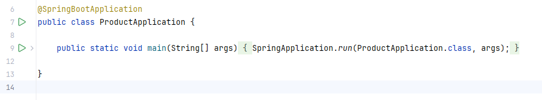
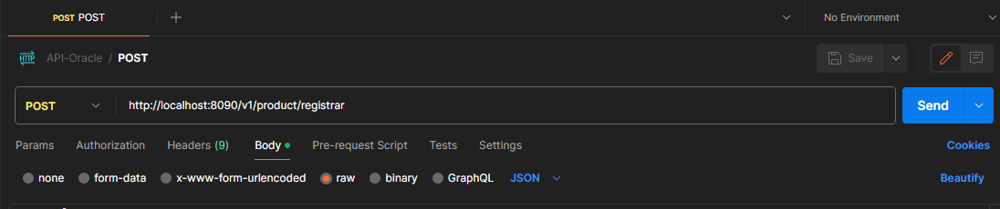
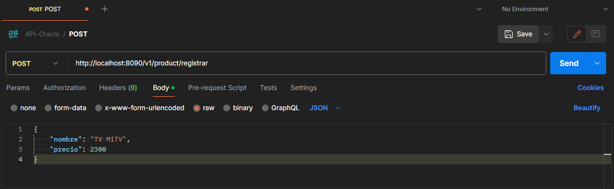
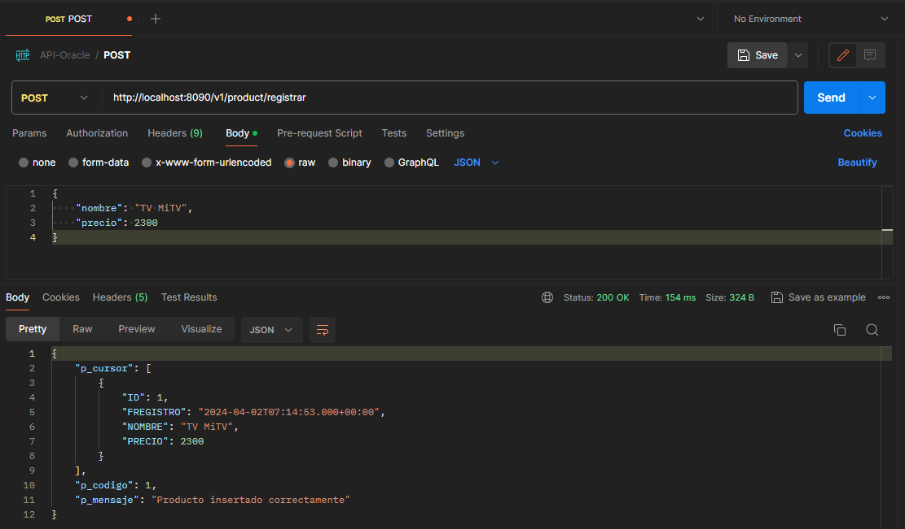
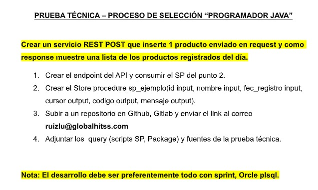

# .:: API Product (v1.0) ::.


## Requisitos previos

* Tener instalado la versión de **Java 17** para que pueda funcionar el proyecto.
* Tener un **IDE** para poder ejecutar el proyecto y/o realizar cambios, en mi caso use **IntelliJ IDEA**.

## Instalación

1. Descargar el código fuente del repositorio:
   ```
   https://github.com/josephmn/product
   ```

2. Ejecutar: el proyecto principal **ProductApplication** (en mi caso uso **IntelliJ IDEA**):

   

## Uso
1. Para realizar la prueba del API:

    * **Postman:**

      


2. Para poder consumir el **API** con **POSTMAN**, este sería la estructura:

    ```
    http://localhost:8090/v1/product/registrar
    ```
   Siendo: **registrar** el método para poder realizar el registro.

   La estructura body a ejecutar sería el siguiente:
    ```
    {
        "nombre": "TV MiTV",
        "precio": 2300
    }
    ```
    * Deberia quedar de la siguiente manera antes de ejecutar:
      


3. Cuando se envíe la petición al API y si todo es correcto, este devuelve el siguiente mensaje:

   

    * Aqui devuelve la siguiente estructura:
      ```
        {
            "p_cursor": [
                {
                    "ID": 1,
                    "FREGISTRO": "2024-04-02T07:14:53.000+00:00",
                    "NOMBRE": "TV MiTV",
                    "PRECIO": 2300
                },
                {
                    "ID": 2,
                    "FREGISTRO": "2024-04-02T07:15:46.000+00:00",
                    "NOMBRE": "TV MiTV2",
                    "PRECIO": 2300
                }
            ],
            "p_codigo": 1,
            "p_mensaje": "Producto insertado correctamente"
        }
      ```

4. Del ejemplo anterior se listará los registros que sean insertados en la misma **fecha de registro**, al igual que un **codigo** y un **mensaje**, como se solicita en el reto técnico.

## Reto Técnico



## Query

        CREATE OR REPLACE PROCEDURE insert_product (
        p_nombre   IN  VARCHAR2,
        p_precio   IN  NUMBER,
        p_cursor   OUT SYS_REFCURSOR,
        p_codigo   OUT NUMBER,
        p_mensaje  OUT VARCHAR2
        )
        AS
        BEGIN
        INSERT INTO PRODUCT (nombre, precio, fregistro)
        VALUES (p_nombre, p_precio, SYSDATE);
        
            p_codigo := 1; -- Código 1 para éxito
            p_mensaje := 'Producto insertado correctamente';
        
            OPEN p_cursor FOR
            /* Capturamos los datos registrados del día */
            SELECT * FROM PRODUCT WHERE TRUNC(FREGISTRO) = TRUNC(SYSDATE);
        EXCEPTION
        WHEN OTHERS THEN
        p_codigo := SQLCODE;
        p_mensaje := SQLERRM;
        END;

        -- TRUNCATE TABLE PRODUCT;
        -- ALTER TABLE PRODUCT MODIFY (ID GENERATED BY DEFAULT ON NULL AS IDENTITY (START WITH 1));

## Contribuir

Por el momento no hay contribuciones.
